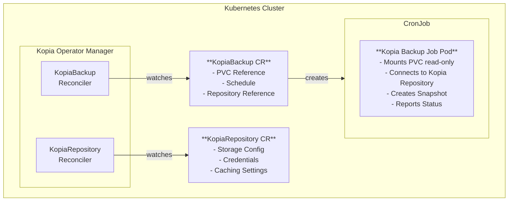
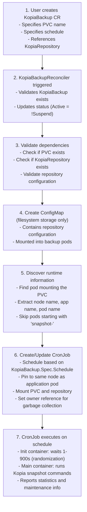
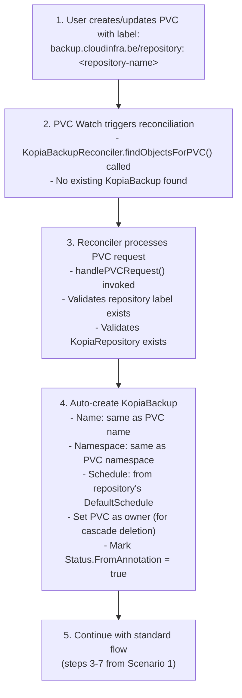

# Kopia Operator Architecture

## Overview

The Kopia Operator is a Kubernetes operator designed to automate backup operations for Persistent Volume Claims (PVCs) using [Kopia](https://kopia.io/), a fast and secure open-source backup/restore tool. This operator provides a declarative approach to managing backup schedules and configurations through Custom Resource Definitions (CRDs).

## Table of Contents

- [Architecture Overview](#architecture-overview)
- [Custom Resource Definitions (CRDs)](#custom-resource-definitions-crds)
- [Components](#components)
- [Operational Flow](#operational-flow)
- [Reconciliation Logic](#reconciliation-logic)
- [Backup Execution](#backup-execution)
- [Storage Backends](#storage-backends)
- [Best Practices and Considerations](#best-practices-and-considerations)

## Architecture Overview

The Kopia Operator follows the standard Kubernetes operator pattern built with the [Kubebuilder](https://kubebuilder.io/) framework and [controller-runtime](https://github.com/kubernetes-sigs/controller-runtime). It watches for changes to custom resources and reconciles the actual state with the desired state.



## Custom Resource Definitions (CRDs)

The operator defines two main CRDs:

### 1. KopiaRepository

Represents a Kopia backup repository where backups are stored.

**API Group:** `backup.cloudinfra.be/v1alpha1`

**Key Fields:**

```go
type KopiaRepositorySpec struct {
    // Repository identity
    Hostname              string  // Kopia repository hostname
    Username              string  // Kopia repository username
    StorageType           string  // Storage backend type (filesystem, sftp)

    // Authentication
    PasswordSecretName    string  // Reference to Secret containing repository password

    // Configuration
    Description                string  // Human-readable description
    ReadOnly                   bool    // Make repository read-only
    PermissiveCacheLoading     bool    // Allow loading stale cache
    EnableActions              bool    // Enable Kopia actions
    DefaultSchedule            string  // Default cron schedule for backups
    FormatBlobCacheDuration    int64   // Cache duration for format blobs

    // Caching options
    Caching                    KopiaRepositoryCachingSpec

    // Storage-specific options
    FileSystemOptions          KopiaRepositoryStorageFileSystemSpec
    SFTPOptions                KopiaRepositoryStorageSFTPSpec
}

type KopiaRepositoryCachingSpec struct {
    CacheDirectory                  string
    ContentCacheSizeBytes           int64  // Default: 5GB
    ContentCacheSizeLimitBytes      int64
    MetadataCacheSizeBytes          int64  // Default: 5GB
    MetadataCacheSizeLimitBytes     int64
    MaxListCacheDuration            int64  // Default: 30 seconds
    MinMetadataSweepAge             int64
    MinContentSweepAge              int64
    MinIndexSweepAge                int64
}
```

**Storage Backends:**

**Filesystem Storage:**

```go
type KopiaRepositoryStorageFileSystemSpec struct {
    Path          string  // Repository path
    FileMode      uint32  // File permissions
    DirectoryMode uint32  // Directory permissions
    FileUID       int     // File owner UID
    FileGID       int     // File owner GID
    NFSPath       string  // NFS export path
    NFSServer     string  // NFS server address
}
```

**SFTP Storage:**

```go
type KopiaRepositoryStorageSFTPSpec struct {
    ConfigMapName string  // ConfigMap with SFTP configuration
}
```

### 2. KopiaBackup

Represents a scheduled backup job for a specific PVC.

**API Group:** `backup.cloudinfra.be/v1alpha1`

**Key Fields:**

```go
type KopiaBackupSpec struct {
    PVCName    string  // Name of the PVC to backup
    Schedule   string  // Cron schedule (e.g., "0 2 * * *")
    Repository string  // Reference to KopiaRepository
    Suspend    bool    // Suspend backup schedule (default: false)
}

type KopiaBackupStatus struct {
    Active         bool  // Whether backup is currently active
    FromAnnotation bool  // Created automatically from PVC annotation
}
```

## Components

### 1. Main Entry Point (`cmd/main.go`)

The main function:

- Initializes the controller manager
- Registers the custom resource schemes
- Sets up health and readiness probes
- Configures metrics server
- Starts both reconcilers:
  - `KopiaBackupReconciler`
  - `KopiaRepositoryReconciler`

**Key configurations:**

- Metrics endpoint: `:8080`
- Health probe endpoint: `:8081`
- Leader election support
- HTTP/2 disabled by default for security

### 2. KopiaRepositoryReconciler

**Location:** `internal/controller/backup/kopiarepository_controller.go`

**Responsibilities:**

- Validates KopiaRepository configurations
- Ensures storage type is supported (filesystem or sftp)
- Verifies authentication credentials are provided
- Simple validation reconciler

**RBAC Permissions:**

```yaml
- groups: backup.cloudinfra.be
  resources: kopiarepositories
  verbs: get, list, watch, create, update, patch, delete
- groups: backup.cloudinfra.be
  resources: kopiarepositories/status
  verbs: get, update, patch
- groups: backup.cloudinfra.be
  resources: kopiarepositories/finalizers
  verbs: update
```

### 3. KopiaBackupReconciler

**Location:** `internal/controller/backup/kopiabackup_controller.go`

**Responsibilities:**

- Manages the lifecycle of backup CronJobs
- Creates ConfigMaps for repository configuration
- Monitors PVCs and Pods for changes
- Auto-creates KopiaBackup from PVC annotations
- Ensures backups run on the same node as the application pod

**RBAC Permissions:**

```yaml
- groups: backup.cloudinfra.be
  resources: kopiabackups
  verbs: get, list, watch, create, update, patch, delete
- groups: batch
  resources: cronjobs
  verbs: get, list, watch, create, update, patch, delete
- groups: ""
  resources: configmaps, pods, persistentvolumeclaims
  verbs: get, list, watch
```

## Operational Flow

### Scenario 1: Manual KopiaBackup Creation



### Scenario 2: Automatic Creation from PVC Annotation



## Reconciliation Logic

### KopiaBackupReconciler.Reconcile()

The main reconciliation loop handles multiple scenarios:

#### 1. **KopiaBackup Found**

```go
func (r *KopiaBackupReconciler) Reconcile(ctx context.Context, req ctrl.Request) {
    // 1. Fetch KopiaBackup resource
    // 2. Update status (Active = !Suspend)
    // 3. Verify PVC exists
    // 4. Check if should delete (annotation removed)
    // 5. Get or delete CronJob if needed
    // 6. Validate KopiaRepository exists
    // 7. Create/update ConfigMap (filesystem only)
    // 8. Get runtime info (node, app, pod)
    // 9. Update labels with pod name
    // 10. Create/update CronJob
}
```

#### 2. **PVC Request (No KopiaBackup)**

When a PVC has the `backup.cloudinfra.be/repository` label but no KopiaBackup exists:

```go
func handlePVCRequest() {
    // 1. Fetch PVC
    // 2. Check for repository label
    // 3. Validate KopiaRepository exists
    // 4. Auto-create KopiaBackup
    // 5. Set owner reference to PVC
    // 6. Mark as FromAnnotation = true
}
```

#### 3. **Cleanup Logic**

```go
func shouldDeleteKopiaBackup() {
    // If KopiaBackup was auto-created (FromAnnotation = true)
    // Check if PVC still has the repository label
    // If label removed, delete the KopiaBackup
}

func getOrDeleteCronJob() {
    // If PVC is deleted
    // Delete associated CronJob
}
```

### Watch Predicates

The operator watches three resource types:

1. **KopiaBackup (Primary)**: Direct reconciliation
2. **PersistentVolumeClaim**: Trigger reconciliation for linked KopiaBackups
3. **Pod**: Trigger reconciliation when pods change (node migration, restarts)

```go
func (r *KopiaBackupReconciler) SetupWithManager(mgr ctrl.Manager) error {
    return ctrl.NewControllerManagedBy(mgr).
        For(&backupv1alpha1.KopiaBackup{}).
        Owns(&batchv1.CronJob{}).
        Watches(&corev1.PersistentVolumeClaim{},
            handler.EnqueueRequestsFromMapFunc(r.findObjectsForPVC)).
        Watches(&corev1.Pod{},
            handler.EnqueueRequestsFromMapFunc(r.findObjectsForPod)).
        Complete(r)
}
```

## Backup Execution

### CronJob Structure

Each KopiaBackup creates a CronJob with the following characteristics:

**Naming Convention:**

```text
snapshot-<first-42-chars-of-pvc-name>-<last-char>
```

**Schedule Settings:**

- ConcurrencyPolicy: `ForbidConcurrent` (no overlapping backups)
- SuccessfulJobsHistoryLimit: 1
- FailedJobsHistoryLimit: 1
- Suspend: from KopiaBackup.Spec.Suspend

**Pod Affinity:**

```yaml
affinity:
  nodeAffinity:
    requiredDuringSchedulingIgnoredDuringExecution:
      nodeSelectorTerms:
        - matchExpressions:
            - key: kubernetes.io/hostname
              operator: In
              values: [<node-name>] # Same node as app pod
```

**Pod Structure:**

```yaml
initContainers:
  - name: wait
    image: ghcr.io/fastlorenzo/kopia:0.16.1
    command: ["/scripts/sleep.sh"]
    args: ["1", "900"] # Random wait 1-900 seconds

containers:
  - name: snapshot
    image: ghcr.io/fastlorenzo/kopia:0.20.1
    args:
      - /bin/bash
      - -c
      - |
        printf "[01/04] Create snapshot ..." && kopia snap create <mount-path>
        printf "[02/04] List snapshots ..." && kopia snap list <mount-path>
        printf "[03/04] Show stats ..." && kopia content stats
        printf "[04/04] Show maintenance info ..." && kopia maintenance info

    volumeMounts:
      - name: data
        mountPath: /data/<namespace>/<app>/<pvc-name>
      - name: config
        mountPath: /config/repository.config
        subPath: repository.config
      - name: repo # For filesystem backend
        mountPath: <repository-path>
      - name: kopia-cache # For SFTP backend
        mountPath: <cache-directory>

    env:
      - name: KOPIA_CACHE_DIRECTORY
        value: <cache-dir>
      - name: KOPIA_LOG_DIR
        value: <log-dir>
      - name: KOPIA_PASSWORD # From secret or direct
        valueFrom: ...
```

**Tolerations:**

```yaml
tolerations:
- effect: NoSchedule
  key: dedicated
    operator: Exists
```

**Labels:**

```yaml
labels:
  backup.cloudinfra.be/pvc-name: <pvc-name>
  backup.cloudinfra.be/node-name: <node-name>
  app.kubernetes.io/name: <app-name>
  sidecar.istio.io/inject: "false" # Disable Istio sidecar
```

### Volume Mounting

The mount path follows this pattern:

```text
/data/<namespace>/<app-name>/<pvc-name>
```

If no app name is found (no `app.kubernetes.io/name` label):

```text
/data/<namespace>/<pvc-name>
```

## Storage Backends

### Filesystem Storage

**Configuration:**

- Mounts NFS share to the backup pod
- Uses ConfigMap for repository configuration
- Stores cache and logs in the repository directory

**Required Volumes:**

1. **data**: The PVC being backed up
2. **config**: ConfigMap with repository.config
3. **repo**: NFS mount for the Kopia repository

**ConfigMap Structure:**

```json
{
  "storage": {
    "type": "filesystem",
    "config": {
      "path": "<repository-path>",
      "dirShards": null
    }
  },
  "caching": {
    "cacheDirectory": "<cache-dir>",
    "maxCacheSize": 5242880000,
    "maxMetadataCacheSize": 5242880000,
    "maxListCacheDuration": 30
  },
  "hostname": "<hostname>",
  "username": "<username>",
  "description": "Cluster",
  "enableActions": true,
  "formatBlobCacheDuration": 900000000000
}
```

### SFTP Storage

**Configuration:**

- Uses ConfigMap for SFTP connection details
- Uses ephemeral EmptyDir for Kopia cache (3GiB)
- No NFS mount required

**Required Volumes:**

1. **data**: The PVC being backed up
2. **config**: ConfigMap with SFTP configuration
3. **kopia-cache**: EmptyDir (3GiB limit)

## Best Practices and Considerations

### 1. **Node Affinity**

The operator ensures backup pods run on the same node as the application pod mounting the PVC. This is crucial for:

- **Performance**: Local disk access is faster than network access
- **Consistency**: Ensures data consistency when backing up
- **Resource efficiency**: Avoids unnecessary network traffic

### 2. **Pod Discovery**

The operator finds the application pod by:

- Listing all pods in the namespace
- Filtering for `Running` phase
- Checking if PVC is mounted
- Skipping pods with names starting with `snapshot-` (backup pods)

If no pod is found, the reconciliation is requeued.

### 3. **Initialization Delay**

The init container introduces a random delay (1-900 seconds) to:

- Prevent backup storms when multiple backups are scheduled
- Distribute load across the backup window
- Reduce resource contention

### 4. **Password Management**

Repository passwords are managed exclusively through Kubernetes Secrets:

- **`passwordSecretName`**: References a Secret containing the repository encryption password
- **`adminPasswordSecretName`**: References a Secret containing the server admin password (server mode only)

The secret must contain a key named `password`.

### 5. **Garbage Collection**

Owner references ensure automatic cleanup:

- KopiaBackup owns CronJob → Deleting KopiaBackup deletes CronJob
- PVC owns auto-created KopiaBackup → Deleting PVC deletes KopiaBackup

### 6. **Label-Based Auto-Creation**

Adding the label `backup.cloudinfra.be/repository: <repo-name>` to a PVC:

- Automatically creates a KopiaBackup
- Uses the repository's DefaultSchedule
- Sets `Status.FromAnnotation = true`
- Removes the label → Automatically deletes KopiaBackup

### 7. **Resource Indexing**

The operator creates a field index on `KopiaBackup.Spec.PVCName` to efficiently:

- Find KopiaBackups for a given PVC
- Support watch predicates
- Enable fast lookups

### 8. **Istio Compatibility**

The backup pods explicitly disable Istio sidecar injection:

```yaml
sidecar.istio.io/inject: "false"
```

This prevents issues with:

- Pod termination (sidecar won't exit)
- Network policies
- Certificate management

### 9. **Job History**

The operator keeps:

- **1** successful job in history
- **1** failed job in history

This limits resource consumption while retaining recent execution status.

### 10. **Kopia Operations**

Each backup execution performs:

1. **Snapshot creation**: `kopia snap create <path>`
2. **Snapshot listing**: `kopia snap list <path>`
3. **Statistics**: `kopia content stats`
4. **Maintenance info**: `kopia maintenance info`

This provides comprehensive logging and status information.

## Repository Discovery

The operator supports cross-namespace repository references:

1. First, looks for repository in the current namespace
2. If not found, searches all namespaces
3. Returns error if multiple repositories with same name exist
4. Returns error if no repository found

This allows for:

- Centralized repository management
- Multi-tenant configurations
- Simplified administration

## Error Handling

The operator handles various error scenarios:

- **PVC not found**: Deletes CronJob, requeues reconciliation
- **Repository not found**: Returns error, logs issue
- **Pod not found**: Requeues reconciliation (pod may be starting)
- **ConfigMap creation failed**: Returns error, retries
- **CronJob creation failed**: Returns error, retries

All errors are logged with appropriate context for debugging.

## Conclusion

The Kopia Operator provides a robust, Kubernetes-native solution for automating PVC backups using Kopia. Its design follows best practices for operators, including:

- Declarative configuration via CRDs
- Automatic reconciliation
- Garbage collection via owner references
- Label-based automation
- Multi-backend support
- Production-ready error handling
- Security best practices (secret management, minimal permissions)

The operator simplifies backup management by abstracting away the complexity of scheduling, configuration, and execution while maintaining flexibility through its CRD-based API.
