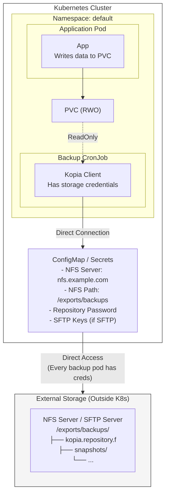
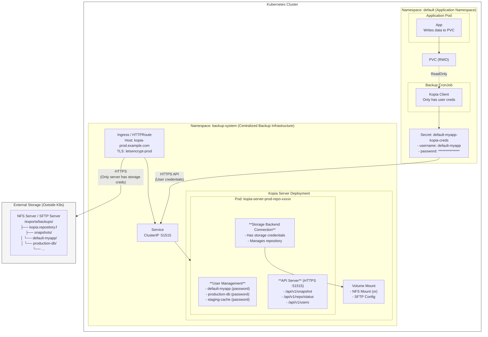
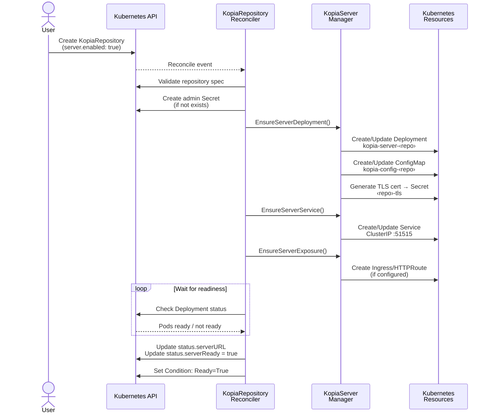
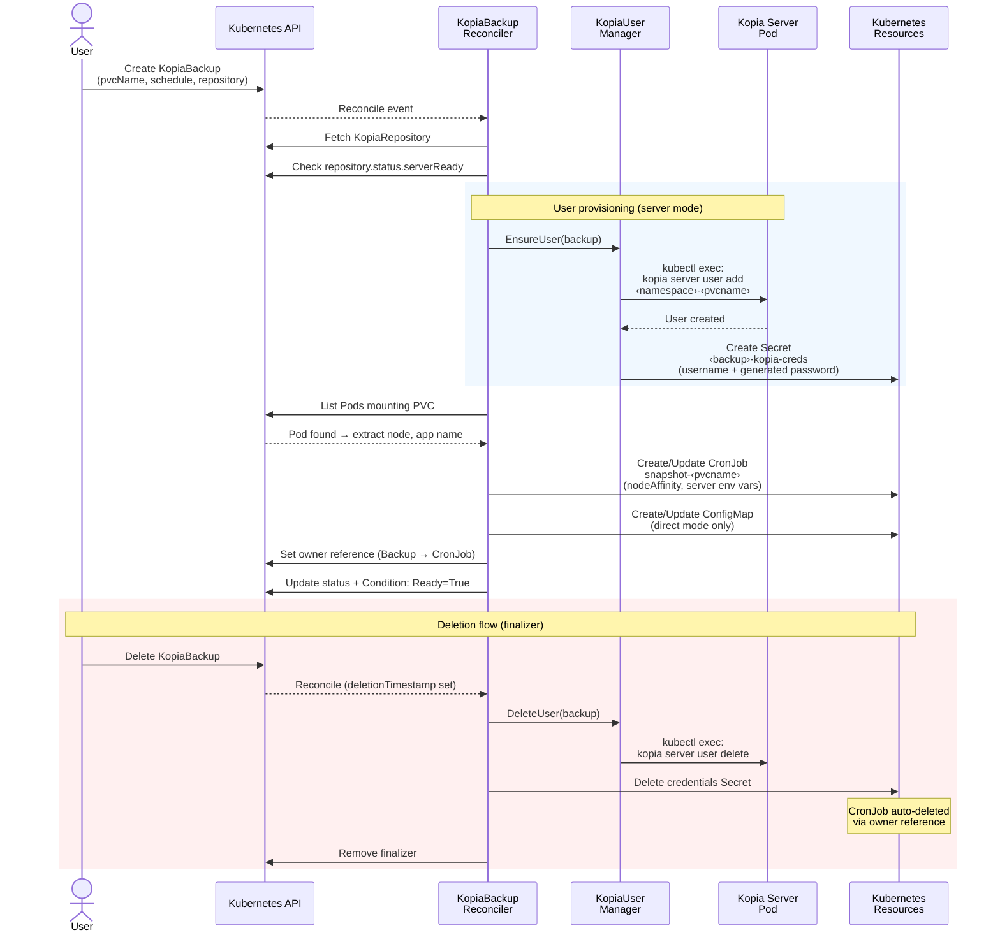
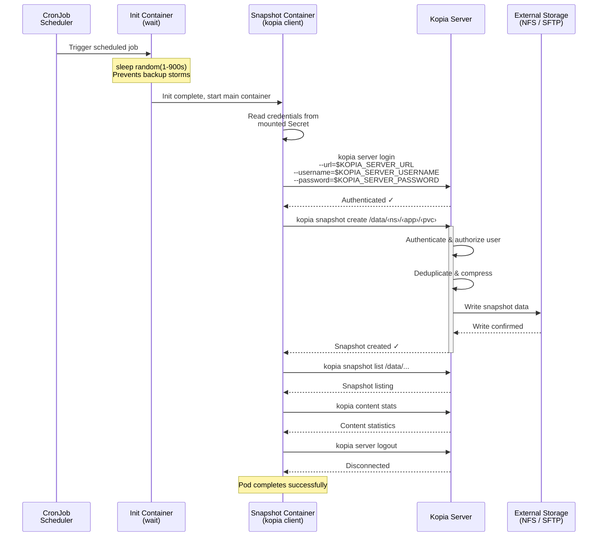
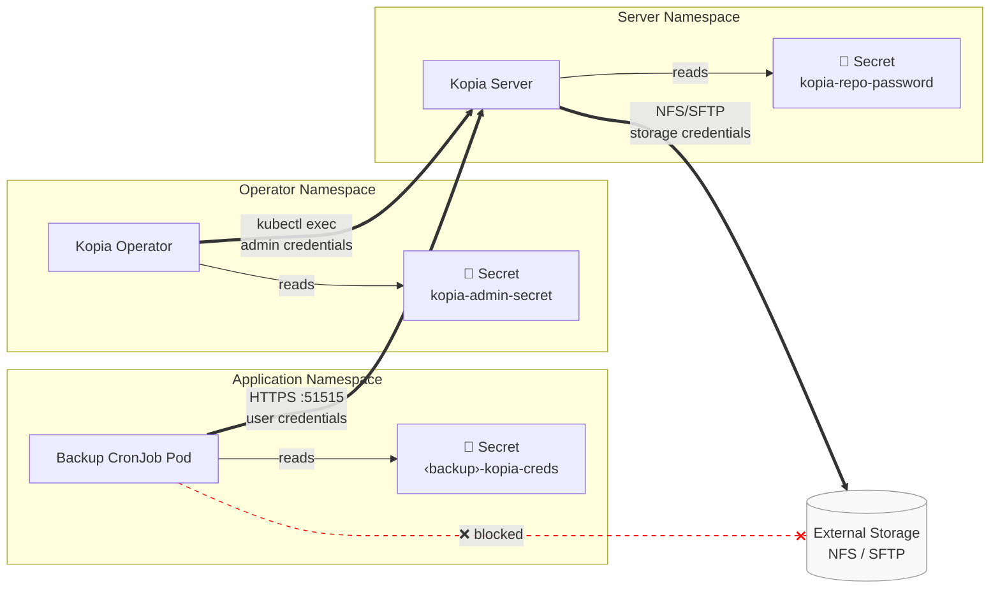
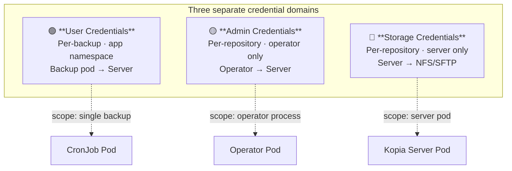
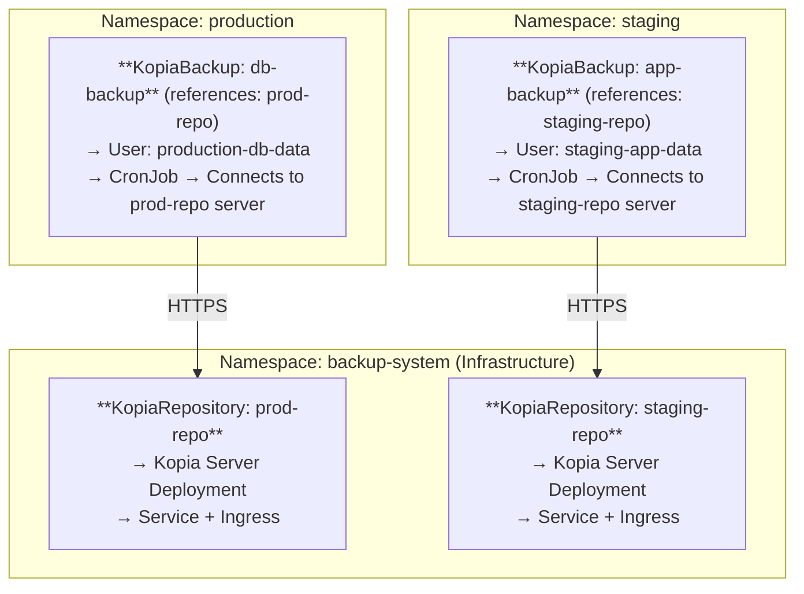
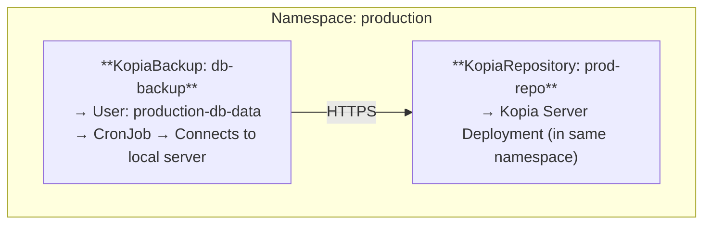

# Kopia Operator Server Mode - Visual Architecture

## Current Architecture (Direct Storage)

> **Issues with Current Architecture:**
> - ❌ Every backup pod needs storage credentials (security risk)
> - ❌ Storage directly exposed to all backup pods (network complexity)
> - ❌ No centralized access control or user management
> - ❌ Difficult to audit who accessed what
> - ❌ Network policies must allow all backup pods to access storage
> - ❌ Credential rotation affects all backup pods

## Target Architecture (Kopia Server Mode)

> **Benefits of New Architecture:**
> - ✅ Only Kopia Server has storage credentials (1 place vs N places)
> - ✅ Per-backup user authentication and authorization
> - ✅ Centralized audit logging and monitoring
> - ✅ Simplified network policies (only server → storage)
> - ✅ Easy credential rotation (only update server)
> - ✅ HTTPS API with TLS encryption
> - ✅ Ingress integration for external access
> - ✅ Better compliance and security posture

## Component Interaction Flow

### 1. Repository Lifecycle

### 2. Backup Lifecycle

### 3. Backup Execution

## Security Architecture

The security model is built around four layers, each enforced by different Kubernetes and Kopia mechanisms.

### Network & Credential Flow

### Layer Details

| Layer | Mechanism | What it protects |
|-------|-----------|-----------------|
| **Network** | Only the Kopia Server connects to storage. Backup pods only talk to the server over HTTPS/TLS. Network policies block direct pod→storage access. | Storage backend isolation |
| **Authentication** | Each KopiaBackup gets a unique username + auto-generated 32+ char password, stored in a namespaced Secret. Server validates credentials on every API call. | Per-backup identity |
| **Authorization** | Users can only access snapshots under their own path (`/data/‹ns›/‹app›/‹pvc›`). Admin user (operator-only) is the sole account that can manage users. | Snapshot isolation |
| **Audit** | Server logs all auth events, snapshot operations, and failed login attempts. Operator logs resource lifecycle events (create/delete users, repos, servers). | Observability & compliance |

### Credential Scoping

## Deployment Topology Options

### Option 1: Namespace-Scoped (Recommended)

> ✅ Centralized server management · ✅ Clear separation of concerns · ✅ Easy to manage server resources · ✅ Single point for monitoring

### Option 2: Co-Located (Alternative)

> ✅ Namespace isolation · ✅ No cross-namespace dependencies · ❌ More resource usage (one server per namespace) · ❌ More complex to manage multiple servers

This visual guide should help understand the architecture change and how all components fit together!
